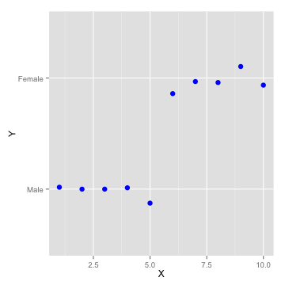
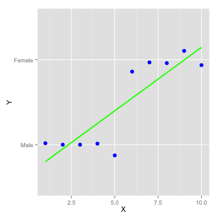
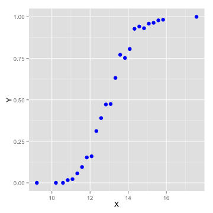
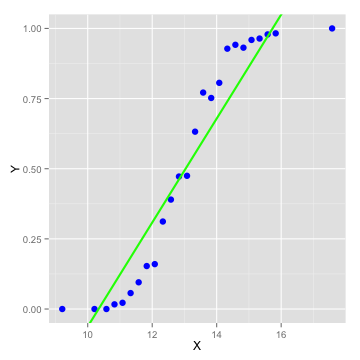
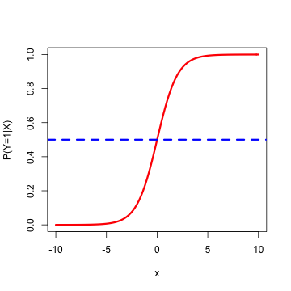
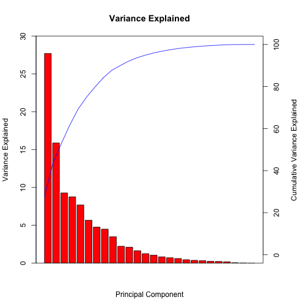
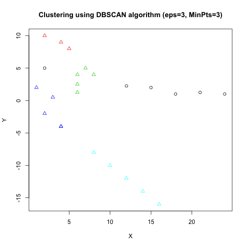
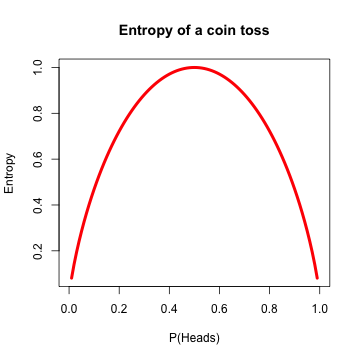

---

title       : Machine Learning with R - Part II
author      : Ilan Man
job         : Strategy Operations  @ Squarespace
framework   : io2012        # {io2012, html5slides, shower, dzslides, ...}
highlighter : highlight.js  # {highlight.js, prettify, highlight}
hitheme     : tomorrow      # 
widgets     : mathjax       # {mathjax, quiz, bootstrap}
mode        : selfcontained # {standalone, draft}

----

## Agenda 
<space>

1. Logistic Regression
2. Principle Component Analysis
3. Clustering
4. Trees

----

## Objectives 
<space>

1. Understand some popular algorithms and techniques
2. Learn how to tune parameters
3. Practice R

----

## Logistic Regression
# Motivation
<space>

 

----

## Logistic Regression
# Motivation
<space>

 

----

## Logistic Regression
# Motivation
<space>

 

----

## Logistic Regression
# Motivation
<space>

 

----

## Logistic Regression
# Motivation
<space>

 

----

## Logistic Regression
# Motivation
<space>

 

----

## Logistic Regression
# Motivation
<space>

- Binary response variable (Y = 1 or Y = 0) association to a set of explanatory variables
- Like Linear Regression with a categorical outcome

----

## Logistic Regression
# Concepts
<space>

- Binary response variable (Y = 1 or Y = 0) association to a set of explanatory variables
- Like Linear Regression with a categorical outcome
- $\hat{y} = \beta_{0} + \beta_{1}x_{1} + ... + \beta_{n}x_{n}$
- becomes<br>
- $\log{\frac{P(Y=1)}{1 - P(Y=1)}} = \beta_{0} + \beta_{1}x_{1} + ... + \beta_{n}x_{n}$
- Can be extended to multiple and/or ordered categories

----

## Logistic Regression
# Concepts
<space>

- Type of regression to predict the probability of being in a class
  - Typical threshold is 0.5
- Assumes error terms are Binomially distributed
  - Generates 1's and 0's as the error term

----

## Logistic Regression
# Concepts
<space>

- Type of regression to predict the probability of being in a class
  - Output is $P(Y=1 | X)$
  - Typical threshold is 0.5
- Assumes error terms are Binomially distributed
  - Generates 1's and 0's as the error term
- Sigmoid (logistic) function: $g(z) = \frac{1}{1+e^{-z}}$
  - Bounded by 0 and 1

----

## Logistic Regression
# Concepts
<space>

 

----

## Logistic Regression
# Find parameters
<space>

- The hypothesis function, $h_{\theta}(x)$, is $P(Y=1|X)$
- Linear regression: $h_{\theta}(x) = \theta x^{T}$
- Logistic regression: $h_{\theta}(x) = g(\theta x^{T})$ 
<br>
where $g(z) = \frac{1}{1+e^{-z}}$

----

## Logistic Regression
# Notation
<space>

- Re-arranging $Y = \frac{1}{1+e^{-\theta x^{T}}}$ yields
<br>
$\log{\frac{Y}{1 - Y}} = \theta x^{T}$
- **Log odds** are linear in $X$
- This is called the logit of $Y$
  - Links the odds of $Y$ (a probability) to a linear regression in $X$
  - Logit ranges from -ve infite to +ve infinite
  - When $x_{1}$ increases by 1 unit, $P(Y=1)$ increases by $e^{\theta_{1}}$

----

## Logistic Regression
# Find parameters
<space>

- So $h_{\theta}(x) = \frac{1}{1+e^{-\theta x^{T}}}$
- Cost function?
- Why can't we use the same cost function as for the linear hypothesis?

----

## Logistic Regression
# Find parameters
<space>

- So $h_{\theta}(x) = \frac{1}{1+e^{-\theta x^{T}}}$
- Cost function?
- Why can't we use the same cost function as for the linear hypothesis?
  - Logistic residuals are Binomially distributed
  - Regression function is not linear in $X$

----

## Logistic Regression
# Find parameters
<space>

- $Y$ can be 1 or 0 (binary case)
- $Y | X$ ~ Bernoulli

----

## Logistic Regression
# Find parameters
<space>

- $Y$ can be 1 or 0 (binary case)
- $Y | X$ ~ Bernoulli
- $P(Y|X) = p$, when $Y$ = 1
- $P(Y|X) = 1-p$, when $Y$ = 0

----

## Logistic Regression
# Find parameters
<space>

- $Y$ can be 1 or 0 (binary case)
- $Y | X$ ~ Bernoulli
- $P(Y|X) = p$, when $Y$ = 1
- $P(Y|X) = 1-p$, when $Y$ = 0
- $P(Y = y_{i}|X) = p^{y_{i}}(1-p)^{1-y_{i}}$
- Taking the log of both sides...

----

## Logistic Regression
# Find parameters
<space>

$cost(h_{\theta}(x), y) = -y \log(h_{\theta}(x)) + (1-y) \log(1-h_{\theta}(x))$<br>

  

----

## Logistic Regression
# Find parameters
<space>

$cost(h_{\theta}(x), y) = -y \log(h_{\theta}(x)) + (1-y) \log(1-h_{\theta}(x))$<br>
- Logistic regression cost function is then<br>
$cost(h_{\theta}(x), y)  = \frac{1}{m} \sum_{i=1}^{m} -y \log(h_{\theta}(x)) + (1-y) \log(1-h_{\theta}(x))$

----

## Logistic Regression
# Find parameters
<space>

$cost(h_{\theta}(x), y) = -y \log(h_{\theta}(x)) + (1-y) \log(1-h_{\theta}(x))$<br>
- Logistic regression cost function is then<br>
$cost(h_{\theta}(x), y)  = \frac{1}{m} \sum_{i=1}^{m} -y \log(h_{\theta}(x_{i})) + (1-y) \log(1-h_{\theta}(x_{i}))$
- Minimize the cost

----

## Logistic Regression
# Find parameters
<space>

- Cannot solve analytically
- Use approximation methods
  - (Stochastic) Gradient Descent
  - Conjugate Descent
  - Newton-Raphson Method
  - BFGS

----

## Logistic Regression
# Newton-Raphson Method
<space>

- Efficient
- Easier to calculate that gradient descent
  - Except for first and second derivatives
- Converges on *global* minimum

----

## Logistic Regression
# Newton-Raphson Method
<space>

- Assume $f'(x_{0})$ is close to zero and $f''(x_{0})$ is positive

----

## Logistic Regression
# Newton-Raphson Method
<space>

- Assume $f'(x_{0})$ is close to zero and $f''(x_{0})$ is positive
- Re-write $f(x)$ as its Taylor expansion:<br>
$f(x) = f(x_{0}) + (x-x_{0})f'(x_{0}) + \frac{1}{2}(x-x_{0})^{2}f''(x_{0})$

----

## Logistic Regression
# Newton-Raphson Method
<space>

- Assume $f'(x_{0})$ is close to zero and $f''(x_{0})$ is positive
- Re-write $f(x)$ as its Taylor expansion:<br>
$f(x) = f(x_{0}) + (x-x_{0})f'(x_{0}) + \frac{1}{2}(x-x_{0})^{2}f''(x_{0})$
- Take the derivative w.r.t $x$ and set = 0<br>
$0 = f'(x_{0}) + \frac{1}{2}f''(x_{0})2(x_{1} − x_{0})$<br>
$x_{1} = x_{0} − \frac{f'(x_{0})}{f''(x_{0})}$
  - $x_{1}$ is a better approximation for the minimum than $x_{0}$
  - and so on...

----

## Logistic Regression
# Newton-Raphson Method
<space>

$f(x) = x^{4} - 3\log(x)$

 

----

## Logistic Regression
# Newton-Raphson Method
<space>


```r
fn <- function(x) x^4 - 3*log(x)
dfn <- function(x) 4*x^3 - 3/x
d2fn <- function(x) 12*x^2 + 3/x^2 

newton <- function(num.its, dfn, d2fn){
  theta <- rep(0,num.its)
  theta[1] <- round(runif(1,0,100),0)

  for (i in 2:num.its) {
    h <- - dfn(theta[i-1]) / d2fn(theta[i-1])
    theta[i] <- theta[i-1] + h 
  }
  
  out <- cbind(1:num.its,theta)
  dimnames(out)[[2]] <- c("iteration","estimate")
  return(out)
}
```

----

## Logistic Regression
# Newton-Raphson Method
<space>


```
     iteration estimate
[1,]         1   18.000
[2,]         2   12.000
[3,]         3    8.000
[4,]         4    5.334
[5,]         5    3.558
```

```
      iteration estimate
[16,]        16   0.9306
[17,]        17   0.9306
[18,]        18   0.9306
[19,]        19   0.9306
[20,]        20   0.9306
```

```
[1] 0.9658
```

----

## Logistic Regression
# Newton-Raphson Method
<space>


```r
optimize(fn,c(-100,100))  ## built-in R optimization function
```

```
$minimum
[1] 0.9306

$objective
[1] 0.9658
```

----

## Logistic Regression
# Newton-Raphson
<space>

- Minimization algorithm
- Approximation, non-closed form solution
- Built-in to many programs

----

## Logistic Regression
# Summary
<space>

- Very popular classification algorithm
- Part of family of GLMs
- Based on Binomial error terms, i.e. 1's and 0's
- Usually requires large sample size
- Assumes linearity between logit function and independent variables
- Does not work out of the box with correlated features...

----

## Principle Component Analysis
# Motivation
<space>

- Unsupervised learning
- Used widely in modern data analysis
- Compute the most meaningful way to re-express noisy data, revealing the hidden structure
- Commonly used to supplement supervised learning algorithms

----

## Principle Component Analysis
# Concepts
<space>


----

## Principle Component Analysis
# Concepts
<space>


----

## Principle Component Analysis
# Concepts
<space>


----

## Principle Component Analysis
# Concepts
<space>


----

## Principle Component Analysis
# Concepts
<space>


----

## Principle Component Analysis
# Concepts
<space>


----

## Principle Component Analysis
# Concepts
<space>


----

## Principle Component Analysis
# Concepts
<space>


----

## Principle Component Analysis
# Concepts
<space>


----

## Principle Component Analysis
# Concepts
<space>

- Assumes linearity
- $\bf{PX}=\bf{Y}$
  - $\bf{X}$ is original dataset, $\bf{P}$ is a transformation of $\bf{X}$ into $\bf{Y}$
- How to choose $\bf{P}$?<br>
  1) Reduce noise<br>
  2) Maximize variance

----

## Principle Component Analysis
# Concepts
<space>

- Covariance matrix<br>
$\bf{C} = \bf{XX}^{T}$

- Restated goals are
  - Minimize covariance and maximize variance
  - Optimal $\bf{C}$ is a diagonal matrix, off diagonals are = 0

----

## Principle Component Analysis
# Concepts
<space>

- Assumes linear relationship between $\bf{X}$ and $\bf{Y}$ (non-linear is a kernel PCA)
- Largest variance indicates most signal
- Orthogonal components - makes the linear algebra easier
- Assumes data is normally distributed, otherwise PCA might not diagonalize matrix
  - Can use ICA...
  - But most data is normal and PCA is robust to slight deviance from normality

----

## Principle Component Analysis
# Eigenwhat?
<space>

$\bf{A}x = \lambda x$
  - $\lambda$ is an eigenvalue of $\bf{A}$ and $x$ is an eigenvector of $\bf{A}$<br>
$\bf{A}x - \lambda Ix = 0$<br>
$(\bf{A} - \lambda I)x = 0$<br>
$\det(\bf{A} - \lambda I)$ = 0 &nbps; <- roots of this yield eigenvalues of $\bf{A}$

----

## Principle Component Analysis
# Eigenwhat?
<space>

\[A = \begin{bmatrix} 5 & 2\\ 2 & 5 \end{bmatrix}, I= \begin{bmatrix} 1 & 0\\ 0 & 1 \end{bmatrix}, X = \begin{bmatrix} x_{1}\\ x_{2} \end{bmatrix}\]


----

## Principle Component Analysis
# Eigenwhat?
<space>

\[A = \begin{bmatrix} 5 & 2\\ 2 & 5 \end{bmatrix}, I= \begin{bmatrix} 1 & 0\\ 0 & 1 \end{bmatrix}, X = \begin{bmatrix} x_{1}\\ x_{2} \end{bmatrix}\]
\[\begin{bmatrix} 5 & 2\\ 2 & 5 \end{bmatrix}X = \lambda X\]

----

## Principle Component Analysis
# Eigenwhat?
<space>

\[A = \begin{bmatrix} 5 & 2\\ 2 & 5 \end{bmatrix}, I= \begin{bmatrix} 1 & 0\\ 0 & 1 \end{bmatrix}, X = \begin{bmatrix} x_{1}\\ x_{2} \end{bmatrix}\]
\[\begin{bmatrix} 5 & 2\\ 2 & 5 \end{bmatrix}X = \lambda X\]
\[\begin{bmatrix} 5 & 2\\ 2 & 5 \end{bmatrix}X - \lambda X = 0\]
\[(\begin{bmatrix} 5 & 2\\ 2 & 5 \end{bmatrix} - \lambda I)X = 0\]

----

## Principle Component Analysis
# Eigenwhat?
<space>

\[\begin{bmatrix} 5 & 2\\ 2 & 5 \end{bmatrix}X = \lambda X\]
\[\begin{bmatrix} 5 & 2\\ 2 & 5 \end{bmatrix}X - \lambda X = 0\]
\[(\begin{bmatrix} 5 & 2\\ 2 & 5 \end{bmatrix} - \lambda I)X = 0\]
\[\left | \begin{bmatrix} 5 & 2\\ 2 & 5 \end{bmatrix} - \lambda I \right |= 0\]
\[\left|\begin{bmatrix} 5 & 2\\ 2 & 5 \end{bmatrix} - \lambda \begin{bmatrix} 1 & 0\\ 0 & 1 \end{bmatrix} \right| = 0\]
\[\left|\begin{bmatrix} 5-\lambda & 2\\ 2 & 5-\lambda \end{bmatrix}\right| = 0\]

----

## Principle Component Analysis
# Eigenwhat?
<space>

$(5-\lambda)\times(5-\lambda) - 4 = 0$
<br>
$\lambda^{2} - 10\lambda + 21 = 0$
<br>
$\lambda = ?$

----

## Principle Component Analysis
# Eigenwhat?
<space>


```r
A = matrix(c(5,2,2,5),nrow=2)
roots <- Re(polyroot(c(21,-10,1)))
roots
```

```
## [1] 3 7
```

----

## Principle Component Analysis
# Eigenwhat?
<space>

- when $\lambda = 3$<br>
$Ax = 3x$<br>

----

## Principle Component Analysis
# Eigenwhat?
<space>

- when $\lambda = 3$<br>
$Ax = 3x$<br>
$5x_{1} + 2x_{2} = 3x_{1}$<br>
$2x_{1} + 5x_{2} = 3x_{2}$<br>

----

## Principle Component Analysis
# Eigenwhat?
<space>

- when $\lambda = 3$<br>
$Ax = 3x$<br>
$5x_{1} + 2x_{2} = 3x_{1}$<br>
$2x_{1} + 5x_{2} = 3x_{2}$<br>
$x_{1} = -x_{2}$<br>

----

## Principle Component Analysis
# Eigenwhat?
<space>

- when $\lambda = 3$<br>
$Ax = 3x$<br>
$5x_{1} + 2x_{2} = 3x_{1}$<br>
$2x_{1} + 5x_{2} = 3x_{2}$<br>
$x_{1} = -x_{2}$<br>

\[Eigenvector = \begin{bmatrix} 1\\ -1 \end{bmatrix}\]

----

## Principle Component Analysis
# Eigenwhat?
<space>

- when $\lambda = 7$<br>
$Ax = 7x$<br>
$5x_{1} + 2x_{2} = 7x_{1}$<br>
$2x_{2} + 5x_{2} = 7x_{2}$<br>
$x_{1} = x_{2}$<br>

----

## Principle Component Analysis
# Eigenwhat?
<space>

- when $\lambda = 7$<br>
$Ax = 7x$<br>
$5x_{1} + 2x_{2} = 7x_{1}$<br>
$2x_{2} + 5x_{2} = 7x_{2}$<br>
$x_{1} = x_{2}$<br>

\[Eigenvector = \begin{bmatrix} 1\\ 1 \end{bmatrix}\]

----

## Principle Component Analysis
# Eigenwhat?
<space>

$Ax = \lambda x$

```r
A %*% c(1,-1) == 3 * as.matrix(c(1,-1))
A %*% c(1,1) == 7 * as.matrix(c(1,1))
```

----

## Principle Component Analysis
# Eigenwhat?
<space>

$Ax = \lambda x$

```r
A %*% c(1,-1) == 3 * as.matrix(c(1,-1))
```

```
     [,1]
[1,] TRUE
[2,] TRUE
```

```r
A %*% c(1,1) == 7 * as.matrix(c(1,1))
```

```
     [,1]
[1,] TRUE
[2,] TRUE
```

----

## Principle Component Analysis
# Eigenwhat?
<space>


```r
m <- matrix(c(1,-1,1,1),ncol=2)   ## two eigenvectors
m <- m/sqrt(norm(m))  ## normalize
as.matrix(m%*%diag(roots)%*%t(m))
```

```
##      [,1] [,2]
## [1,]    5    2
## [2,]    2    5
```

----

## Principle Component Analysis
# Motivation
<space>

$\bf{PX} = \bf{Y}$<br>
$\bf{C_{Y}} = \frac{1}{(n-1)}\bf{YY^{T}}$<br>

----

## Principle Component Analysis
# Motivation
<space>

$\bf{PX} = \bf{Y}$<br>
$\bf{C_{Y}} = \frac{1}{(n-1)}\bf{YY^{T}}$<br>
$=\bf{PX(PX)^{T}}$<br>
$=\bf{P(XX^{T})P^{T}}$<br>

----

## Principle Component Analysis
# Motivation
<space>

$\bf{PX} = \bf{Y}$<br>
$\bf{C_{Y}} = \frac{1}{(n-1)}\bf{YY^{T}}$<br>
$=\bf{PX(PX)^{T}}$<br>
$=\bf{P(XX^{T})P^{T}}$<br>
$=\bf{PAP^{T}}$<br>
- $\bf{P}$ is a matrix with columns that are eigenvectors
- $\bf{A}$ is a diagonalized matrix of eigenvalues and is symmetric<br>
$\bf{A} = \bf{EDE^{T}}$

----

## Principle Component Analysis
# Motivation
<space>

- Each row of $\bf{P}$ should be an eigenvector of $\bf{A}$<br>
$\bf{P} = \bf{E^{T}}$
- Note that $\bf{P^{T}} = \bf{P^{-1}}$ (linear algebra)<br>

----

## Principle Component Analysis
# Motivation
<space>

- Each row of $\bf{P}$ should be an eigenvector of $\bf{A}$<br>
$\bf{P} = \bf{E^{T}}$
- Note that $\bf{P^{T}} = \bf{P^{-1}}$ (linear algebra)<br>
$\bf{A} = \bf{P^{T}DP}$<br>
$\bf{C_{Y}} = \bf{PAP^{T}}$<br>
$\bf{C_{Y}} = \bf{PP^{T}DPP^{T}} = \frac{1}{n-1}\bf{D}$
- $\bf{D}$ is a diagonal matrix, depending on how we choose $\bf{P}$
- Therefore $\bf{C_{Y}}$ is diagonalized

----

## Principle Component Analysis
# Example
<space>


```r
data <- read.csv('tennis_data_2013.csv')
```

```
## Warning: cannot open file 'tennis_data_2013.csv': No such file or
## directory
```

```
## Error: cannot open the connection
```

```r
data$Player1 <- as.character(data$Player1)
```

```
## Error: replacement has 0 rows, data has 6497
```

```r
data$Player2 <- as.character(data$Player2)
```

```
## Error: replacement has 0 rows, data has 6497
```

```r
tennis <- data
m <- length(data)

for (i in 10:m){
  tennis[,i] <- ifelse(is.na(data[,i]),0,data[,i])
}

str(tennis)
```

```
## 'data.frame':	6497 obs. of  13 variables:
##  $ type                : Factor w/ 2 levels "red","white": 1 1 1 1 1 1 1 1 1 1 ...
##  $ fixed.acidity       : num  7.4 7.8 7.8 11.2 7.4 7.4 7.9 7.3 7.8 7.5 ...
##  $ volatile.acidity    : num  0.7 0.88 0.76 0.28 0.7 0.66 0.6 0.65 0.58 0.5 ...
##  $ citric.acid         : num  0 0 0.04 0.56 0 0 0.06 0 0.02 0.36 ...
##  $ residual.sugar      : num  1.9 2.6 2.3 1.9 1.9 1.8 1.6 1.2 2 6.1 ...
##  $ chlorides           : num  0.076 0.098 0.092 0.075 0.076 0.075 0.069 0.065 0.073 0.071 ...
##  $ free.sulfur.dioxide : num  11 25 15 17 11 13 15 15 9 17 ...
##  $ total.sulfur.dioxide: num  34 67 54 60 34 40 59 21 18 102 ...
##  $ density             : num  0.998 0.997 0.997 0.998 0.998 ...
##  $ pH                  : num  3.51 3.2 3.26 3.16 3.51 3.51 3.3 3.39 3.36 3.35 ...
##  $ sulphates           : num  0.56 0.68 0.65 0.58 0.56 0.56 0.46 0.47 0.57 0.8 ...
##  $ alcohol             : num  9.4 9.8 9.8 9.8 9.4 9.4 9.4 10 9.5 10.5 ...
##  $ quality             : int  5 5 5 6 5 5 5 7 7 5 ...
```

```r
features <- tennis[,10:m]

head(features)
```

```
##     pH sulphates alcohol quality
## 1 3.51      0.56     9.4       5
## 2 3.20      0.68     9.8       5
## 3 3.26      0.65     9.8       5
## 4 3.16      0.58     9.8       6
## 5 3.51      0.56     9.4       5
## 6 3.51      0.56     9.4       5
```

```r
str(features)
```

```
## 'data.frame':	6497 obs. of  4 variables:
##  $ pH       : num  3.51 3.2 3.26 3.16 3.51 3.51 3.3 3.39 3.36 3.35 ...
##  $ sulphates: num  0.56 0.68 0.65 0.58 0.56 0.56 0.46 0.47 0.57 0.8 ...
##  $ alcohol  : num  9.4 9.8 9.8 9.8 9.4 9.4 9.4 10 9.5 10.5 ...
##  $ quality  : int  5 5 5 6 5 5 5 7 7 5 ...
```

```r
dim(features)
```

```
## [1] 6497    4
```

----

## Principle Component Analysis
# Example
<space>


```r
scaled_features <- as.matrix(scale(features))
Cx <- cov(scaled_features)
eigenvalues <- eigen(Cx)$values
eigenvectors <- eigen(Cx)$vectors
PC <- scaled_features %*% eigenvectors
```

----

## Principle Component Analysis
# Example
<space>


```r
Cy <- cov(PC)
sum(round(diag(Cy) - eigenvalues,5))
```

```
## [1] 0
```

```r
sum(round(Cy[upper.tri(Cy)],5)) ## off diagonals are 0 since PC's are orthogonal
```

```
## [1] 0
```

----

## Principle Component Analysis
# Example
<space>

 

----

## Principle Component Analysis
# Example
<space>


```r
pca.df <- prcomp(scaled_features)
eigenvalues == (pca.df$sdev)^2
```

```
## [1] FALSE FALSE FALSE FALSE
```

```r
eigenvectors[,1] == pca.df$rotation[,1]
```

```
##        pH sulphates   alcohol   quality 
##     FALSE     FALSE     FALSE     FALSE
```

```r
sum((eigenvectors[,1])^2)
```

```
## [1] 1
```

----

## Principle Component Analysis
# Example
<space>


```
## Error: object 'gender' not found
```

----

## Principle Component Analysis
# Example
<space>

- Classify based on PC1?


```r
gen <- ifelse(pca.df$x[,1] > abs(mean(pca.df$x[,1]))*2,"F","M")
sum(diag(table(gen,as.character(data$Gender))))/rows
```

```
## Error: all arguments must have the same length
```

----

## Principle Component Analysis
# Summary
<space>

- Very popular dimensionality reduction technique
- Intuitive
- Cannot reverse engineer dataset easily
- Sparse PCA emphasizes important features
- Non-linear structure is difficult to model with PCA
- Extensions (ICA, kernel PCA) developed to generalize

----

## Clustering
# Motivation
<space>

- Separate data into meaningful or useful groups
  - Capture natural structure of the data
  - Starting point for further analysis
- Cluster for utility
  - Summarizing data for less expensive computation
  - Data compression

----

## Clustering
# Types of Clusters
<space>

- Data that looks similar
- Prototype based
- Density based

----

## Clustering
# Typical clustering problem
<space>

 

----

## Clustering
# Density based cluster
<space>


----

## Clustering
# Kmeans algorithm
<space>

- Select K points as initial centroids 
- Do
  - Form K clusters by assigning each point to its closest centroid
  - Recompute the centroid of each cluster 
- Until centroids do not change, or change very minimally, i.e. <1%

----

## Clustering
# Kmeans algorithm
<space>

- Use similarity measures (Euclidean or cosine) depending on the data
- Minimize the squared distance of each point to closest centroid
$SSE(k) = \sum_{i=1}^{m}\sum_{j=1}^{n} (x_{ij} - \bar{x}_{kj})$

----

## Clustering
# Kmeans - notes
<space>

- Choose initial K randomly 
  - can lead to poor centroids - local minimuum
  - Run kmeans multiple times
- Reduce the total SSE by increasing K
- Increase the cluster with largest SSE
- Decrease K and minimize SSE
- Split up a cluster into other clusters
  - The centroid that is split will increase total SSE the least

----

## Clustering
# Kmeans
<space>

- Bisecting K means
  - Split points into 2 clusters
    - Take cluster with largest SSE - split that into two clusters
  - Rerun bisecting K mean on resulting clusters
  - Stop when you have K clusters
- Less susceptible to initialization problems

----

## Clustering
# Kmean fails
<space>


----

## Clustering
# Kmean fails
<space>


----

## Clustering
# Kmean fails
<space>


----

## Clustering
# Kmeans
<space>


```r
wine <- read.csv('http://archive.ics.uci.edu/ml/machine-learning-databases/wine/wine.data')
names(wine) <- c("class",'Alcohol','Malic','Ash','Alcalinity','Magnesium','Total_phenols',
                 'Flavanoids','NFphenols','Proanthocyanins','Color','Hue','Diluted','Proline')
str(wine)
```

```
## 'data.frame':	177 obs. of  14 variables:
##  $ class          : int  1 1 1 1 1 1 1 1 1 1 ...
##  $ Alcohol        : num  13.2 13.2 14.4 13.2 14.2 ...
##  $ Malic          : num  1.78 2.36 1.95 2.59 1.76 1.87 2.15 1.64 1.35 2.16 ...
##  $ Ash            : num  2.14 2.67 2.5 2.87 2.45 2.45 2.61 2.17 2.27 2.3 ...
##  $ Alcalinity     : num  11.2 18.6 16.8 21 15.2 14.6 17.6 14 16 18 ...
##  $ Magnesium      : int  100 101 113 118 112 96 121 97 98 105 ...
##  $ Total_phenols  : num  2.65 2.8 3.85 2.8 3.27 2.5 2.6 2.8 2.98 2.95 ...
##  $ Flavanoids     : num  2.76 3.24 3.49 2.69 3.39 2.52 2.51 2.98 3.15 3.32 ...
##  $ NFphenols      : num  0.26 0.3 0.24 0.39 0.34 0.3 0.31 0.29 0.22 0.22 ...
##  $ Proanthocyanins: num  1.28 2.81 2.18 1.82 1.97 1.98 1.25 1.98 1.85 2.38 ...
##  $ Color          : num  4.38 5.68 7.8 4.32 6.75 5.25 5.05 5.2 7.22 5.75 ...
##  $ Hue            : num  1.05 1.03 0.86 1.04 1.05 1.02 1.06 1.08 1.01 1.25 ...
##  $ Diluted        : num  3.4 3.17 3.45 2.93 2.85 3.58 3.58 2.85 3.55 3.17 ...
##  $ Proline        : int  1050 1185 1480 735 1450 1290 1295 1045 1045 1510 ...
```

- set.seed() to make sure results are reproducible
- add nstart to the function call so that it attempts multiple configurations, selecting the best
- use a screeplot to select optimal K

----

## Clustering
# Kmeans
<space>


```r
s.wine <- scale(wine[,-1])
best_k <- 0
num_k <- 20
for (i in 1:num_k){
  best_k[i] <- sum(kmeans(s.wine,centers=i)$withinss)
  }

barplot(best_k, xlab = "Number of clusters",
        names.arg = 1:num_k,
        ylab="Within groups sum of squares",
        main="Scree Plot for Wine dataset")
```

 

----

## Clustering
# Kmeans animation
<space>

install.packages('animation')
library(animation)

oopt = ani.options(interval = 1)
ani_ex = rbind(matrix(rnorm(100, sd = 0.3), ncol = 2), 
          matrix(rnorm(100, sd = 0.3), 
          ncol = 2))
colnames(ani_ex) = c("x", "y")

kmeans.an = function(
  x = cbind(X1 = runif(50), X2 = runif(50)), centers = 4, hints = c('Move centers!', 'Find cluster?'),
  pch = 1:5, col = 1:5
) {
  x = as.matrix(x)
  ocluster = sample(centers, nrow(x), replace = TRUE)
  if (length(centers) == 1) centers = x[sample(nrow(x), centers), ] else
    centers = as.matrix(centers)
  numcent = nrow(centers)
  dst = matrix(nrow = nrow(x), ncol = numcent)
  j = 1
  pch = rep(pch, length = numcent)
  col = rep(col, length = numcent)
  
  for (j in 1:ani.options('nmax')) {
    dev.hold()
    plot(x, pch = pch[ocluster], col = col[ocluster], panel.first = grid())
    mtext(hints[1], 4)
    points(centers, pch = pch[1:numcent], cex = 3, lwd = 2, col = col[1:numcent])
    ani.pause()
    for (i in 1:numcent) {
      dst[, i] = sqrt(apply((t(t(x) - unlist(centers[i, ])))^2, 1, sum))
    }
    ncluster = apply(dst, 1, which.min)
    plot(x, type = 'n')
    mtext(hints[2], 4)
    grid()
    ocenters = centers
    for (i in 1:numcent) {
      xx = subset(x, ncluster == i)
      polygon(xx[chull(xx), ], density = 10, col = col[i], lty = 2)
      points(xx, pch = pch[i], col = col[i])
      centers[i, ] = apply(xx, 2, mean)
    }
    points(ocenters, cex = 3, col = col[1:numcent], pch = pch[1:numcent], lwd = 2)
    ani.pause()
    if (all(ncluster == ocluster)) break
    ocluster = ncluster
  }
  invisible(list(cluster = ncluster, centers = centers))
}

kmeans.an(ani_ex, centers = 5, hints = c("Move centers","Cluster found?"))

----

## Clustering
# K-medoid
<space>

- multiple distance metrics
- robust medioids
- computationally expensive
- cluster center is one of the points itself

----

## Clustering
# K-medoid
<space>

- cluster each point based on the closest center
- replace each center by the medioid of points in its cluster

----

## Clustering
# K-medoid
<space>

- Selecting the optimal number of clusters
- For each point p, first find the average distance between p and all other points in the same cluster, $A$
- Then find the average distance between p and all points in the nearest cluster, $B$
- The silhouette coefficient for p is $\frac{A - B}{\max(A,B)}$
  - Values close to 1 mean point clearly belongs to that cluster
  - Values close to 0 mean points might belong in another cluster

----

## Clustering
# K-medoid
<space>


```r
library(cluster)

pam.best <- as.numeric()
for (i in 2:20){
  pam.best[i] <- pam(s.wine, k=i)$silinfo$avg.width
}
best_k <- which.max(pam.best)
best_k
```

```
## [1] 3
```

----

## Clustering
# K-medoid
<space>


```r
clusplot(pam(s.wine,best_k), main="K-medoids with K = 3",sub=NULL)
```

 

----

## Clustering
# DBSCAN
<space>

- A cluster is a dense region of points separated by low-density regions
- Group objects into one cluster if they are connected to one another by densely populated area
- Used when the clusters are irregular or intertwined, and when noise and outliers are present
- 

----

## Clustering
# Terminology
<space>

- Core points are located inside a cluster
- Border points are on the borders between two clusters
- Neighborhood of p are all points within some radius of p, Eps

----

## Clustering
# Terminology
<space>

- Core points are located inside a cluster
- Border points are on the borders between two clusters
- Neighborhood of p are all points within some radius of p, Eps


----

## Clustering
# Terminology
<space>

- Core points are located inside a cluster
- Border points are on the borders between two clusters
- Neighborhood of p are all points within some radius of p, Eps
- High density region has at least Minpts within Eps of point p
- Noise points are not within Eps of border or core points

----

## Clustering
# Terminology
<space>

- Core points are located inside a cluster
- Border points are on the borders between two clusters
- Neighborhood of p are all points within some radius of p, Eps
- High density region has at least Minpts within Eps of point p
- Noise points are not within Eps of border or core points
- If p is density connected to q, they are part of the same cluster, if not, then they are not
- If p is not density connected to any other point, its considered noise

----

## Clustering
# DBSCAN
<space>


----

## Clustering
# DBSCAN
<space>


```r
x <- c(2,2,8,5,7,6,1,4)
y <- c(10,5,4,8,5,4,2,9)
cluster <- data.frame(X=c(x,2*x,3*x),Y=c(y,-2*x,1/4*y))
plot(cluster)
```

 

----

## Clustering
# DBSCAN
<space>


```r
library(fpc)
cluster_DBSCAN<-dbscan(cluster, eps=3, MinPts=2, method="hybrid")
plot(cluster_DBSCAN, cluster, main="Clustering using DBSCAN algorithm (eps=3, MinPts=3)")
```

 

----

## Clustering
# Summary
<space>

- Unsupervised learning
- Not a perfect science - lots of interpretation
  - Dependent on values of K, Eps
- Hard to define "correct" clustering
- Many types of algorithms

----

## Trees
# Motivation
<space>

- representation of decisions made in order to classify or predict


----

## Trees
# Structure
<space>


----

## Trees
# Structure
<space>

- recursive partitioning -> "divide and conquer"
- going down, choose feature that is most *predictive* of target class
  - split the data according to feature
  - continue...

----

## Trees
# Structure
<space>

until...
- all examples at a node are in same class
- no more features left to distinguish (prone to overfitting)
- tree has grown to some prespecified limit (prune)

----

## Trees
# Algorithms
<space>

- ID3
  - original, popular, DT implementation
- C4.5
  - like ID3 +
  - handles continuous cases
  - imputing missing values
  - weighing costs
  - pruning post creation
- C5.0
  - like C4.5 + 
  - faster, less memory usage
  - boosting

----

## Trees
# Selecting features
<space>

- How does tree decide how to select feature?
  - purity of resulting split
- __Entropy__: amount of information contained in a random variable
  - For a feature with N classes:
    - 0 = purely homogenous
    - $\log_{2}(N)$ = completely mixed

----

## Trees
# Entropy
<space>

$Entropy(S) = \sum_{i=1}^{c} -p_{i}\log_{2}(p_{i})$
  - where $S$ is a dataset
  - $c$ is the number of levels in that data
  - $p_{i}$ is the proportion of values in that level

----

## Trees
# Entropy - example
<space>

What is the entropy of a fair, 6 sided die?


```r
entropy <- function(probs){
  ent <- 0
  for(i in probs){
    ent_temp <- -i*log2(i)
    ent <- ent + ent_temp
  }
  return(ent)
}
```

----

## Trees
# Entropy - example
<space>


```r
fair <- rep(1/6,6)
entropy(fair)
```

```
## [1] 2.585
```

```r
log2(6)
```

```
## [1] 2.585
```

----

## Trees
# Entropy - example
<space>

What is the entropy of a biased, 6 sided die?
- $P(X=1) = P(X=2) = P(X=3) = 1/9$
- $P(X=4) = P(X=5) = P(X=6) = 2/9$


```r
biased <- c(rep(1/9,3),rep(2/9,3))
entropy(biased)
```

```
[1] 2.503
```

----

## Trees
# Entropy - example
<space>


```r
more_biased <- c(rep(1/18,3),rep(5/18,3))
entropy(more_biased)
```

```
[1] 2.235
```

```r
most_biased <- c(rep(1/100,5),rep(95/100,1))
entropy(most_biased)
```

```
[1] 0.4025
```

----

## Trees
# Entropy - example
<space>


```r
curve(-x*log2(x)-(1 - x)*log2(1 - x), col =" red", xlab = "x", ylab = "Entropy", 
      lwd = 4, main='Entropy of a coin toss')
```

 

----

## Trees
# Entropy
<space>

- C5.0 uses the change in entropy to determine the change in purity
- InfoGain = Entropy (pre split) - Entropy (post split)
  - Entropy (pre split) = current Entropy
  - Entropy (post split) is trickier
    - need to consider Entropy of each possible split
  - $E(post) = \sum_{i=1}^{n}w_{i}Entropy(P_{i})$

- Notes:
  - The more a feature splits the data in obvious ways, the less informative it is, entropy is lower
  - The more a feature splits the data - in general - the higher the entropy and hence information gained by splitting at that feature

----

## Trees
# Example
<space>


```r
voting_data <- read.csv('http://archive.ics.uci.edu/ml/machine-learning-databases/voting-records/house-votes-84.data')
names(voting_data) <- c('party','handicapped-infants','water-project-cost-sharing',
                        'adoption-of-the-budget-resolution','physician-fee-freeze',
                        'el-salvador-aid','religious-groups-in-schools',
                        'anti-satellite-test-ban','aid-to-nicaraguan-contras',
                        'mx-missile','immigration','synfuels-corporation-cutback',
                        'education-spending','superfund-right-to-sue','crime',
                        'duty-free-exports','export-administration-act-south-africa')
```

----

## Trees
# Example
<space>


```r
prop.table(table(voting_data[,1]))
```

```

  democrat republican 
    0.6152     0.3848 
```

```r
n <- nrow(voting_data)
train_ind <- sample(n,2/3*n)
voting_train <- voting_data[train_ind,]
voting_test <- voting_data[-train_ind,]
```

----

## Trees
# Example
<space>


----

## Trees
# Example
<space>


```

 
   Cell Contents
|-------------------------|
|                       N |
|         N / Table Total |
|-------------------------|

 
Total Observations in Table:  145 

 
             | predicted class 
actual class |   democrat | republican |  Row Total | 
-------------|------------|------------|------------|
    democrat |         84 |          2 |         86 | 
             |      0.579 |      0.014 |            | 
-------------|------------|------------|------------|
  republican |          3 |         56 |         59 | 
             |      0.021 |      0.386 |            | 
-------------|------------|------------|------------|
Column Total |         87 |         58 |        145 | 
-------------|------------|------------|------------|

 
```

----

## Trees
# Example
<space>


```r
# most important variables
head(C5imp(tree_model))
```

```
##                                   Overall
## physician-fee-freeze                97.92
## synfuels-corporation-cutback        39.79
## mx-missile                          10.03
## water-project-cost-sharing           7.96
## adoption-of-the-budget-resolution    5.54
## handicapped-infants                  0.00
```

----

## Trees
# Example
<space>


```r
# in-sample error rate
summary(tree_model)
```

```
## 
## Call:
## C5.0.default(x = voting_train[, -1], y = voting_train[, 1], trials = 1)
## 
## 
## C5.0 [Release 2.07 GPL Edition]  	Tue Aug 26 08:26:17 2014
## -------------------------------
## 
## Class specified by attribute `outcome'
## 
## Read 289 cases (17 attributes) from undefined.data
## 
## Decision tree:
## 
## physician-fee-freeze in {?,n}: democrat (170.5/2.2)
## physician-fee-freeze = y:
## :...synfuels-corporation-cutback in {?,n}: republican (94.7/2.7)
##     synfuels-corporation-cutback = y:
##     :...mx-missile = ?: republican (0)
##         mx-missile = y: democrat (4.2)
##         mx-missile = n:
##         :...water-project-cost-sharing in {?,n}: republican (4.4)
##             water-project-cost-sharing = y:
##             :...adoption-of-the-budget-resolution in {?,
##                 :                                     n}: republican (11.6/2.3)
##                 adoption-of-the-budget-resolution = y: democrat (3.5)
## 
## 
## Evaluation on training data (289 cases):
## 
## 	    Decision Tree   
## 	  ----------------  
## 	  Size      Errors  
## 
## 	     6    7( 2.4%)   <<
## 
## 
## 	   (a)   (b)    <-classified as
## 	  ----  ----
## 	   177     4    (a): class democrat
## 	     3   105    (b): class republican
## 
## 
## 	Attribute usage:
## 
## 	 97.92%	physician-fee-freeze
## 	 39.79%	synfuels-corporation-cutback
## 	 10.03%	mx-missile
## 	  7.96%	water-project-cost-sharing
## 	  5.54%	adoption-of-the-budget-resolution
## 
## 
## Time: 0.0 secs
```

----

## Trees
# Boosting
<space>

- by combining a number of weak performing learners create a team that is much stronger than any one of the learners alone.
- this is where C5.0 improves on C4.5

----

## Trees
# Example - Boosting
<space>


```r
boosted_tree_model <- C5.0(voting_train[,-1],voting_train[,1], trials=25)
boosted_tennis_predict <- predict(boosted_tree_model,voting_test[,-1])

boosted_conf <- CrossTable(voting_test[,1], boosted_tennis_predict, prop.chisq = FALSE,
                           prop.c = FALSE, prop.r = FALSE, 
                           dnn = c("actual class", "predicted class"))
```

```
## 
##  
##    Cell Contents
## |-------------------------|
## |                       N |
## |         N / Table Total |
## |-------------------------|
## 
##  
## Total Observations in Table:  145 
## 
##  
##              | predicted class 
## actual class |   democrat | republican |  Row Total | 
## -------------|------------|------------|------------|
##     democrat |         84 |          2 |         86 | 
##              |      0.579 |      0.014 |            | 
## -------------|------------|------------|------------|
##   republican |          3 |         56 |         59 | 
##              |      0.021 |      0.386 |            | 
## -------------|------------|------------|------------|
## Column Total |         87 |         58 |        145 | 
## -------------|------------|------------|------------|
## 
## 
```

----

## Trees
# Example - Boosting
<space>


```r
# in-sample error rate
summary(boosted_tree_model)
```

```
## 
## Call:
## C5.0.default(x = voting_train[, -1], y = voting_train[, 1], trials = 25)
## 
## 
## C5.0 [Release 2.07 GPL Edition]  	Tue Aug 26 08:26:17 2014
## -------------------------------
## 
## Class specified by attribute `outcome'
## 
## Read 289 cases (17 attributes) from undefined.data
## 
## -----  Trial 0:  -----
## 
## Decision tree:
## 
## physician-fee-freeze in {?,n}: democrat (170.5/2.2)
## physician-fee-freeze = y:
## :...synfuels-corporation-cutback in {?,n}: republican (94.7/2.7)
##     synfuels-corporation-cutback = y:
##     :...mx-missile = ?: republican (0)
##         mx-missile = y: democrat (4.2)
##         mx-missile = n:
##         :...water-project-cost-sharing in {?,n}: republican (4.4)
##             water-project-cost-sharing = y:
##             :...adoption-of-the-budget-resolution in {?,
##                 :                                     n}: republican (11.6/2.3)
##                 adoption-of-the-budget-resolution = y: democrat (3.5)
## 
## -----  Trial 1:  -----
## 
## Decision tree:
## 
## education-spending in {?,n}: democrat (175/29.1)
## education-spending = y:
## :...synfuels-corporation-cutback in {?,n}: republican (77.4/5.8)
##     synfuels-corporation-cutback = y: democrat (36.6/11.2)
## 
## -----  Trial 2:  -----
## 
## Decision tree:
## 
## physician-fee-freeze in {?,n}: democrat (133.9/23.6)
## physician-fee-freeze = y:
## :...immigration in {?,y}: republican (67.3/2.3)
##     immigration = n:
##     :...duty-free-exports in {?,n}: republican (66.2/19.8)
##         duty-free-exports = y: democrat (21.6/3.1)
## 
## -----  Trial 3:  -----
## 
## Decision tree:
## 
## mx-missile in {?,y}: democrat (109.6/18.8)
## mx-missile = n:
## :...synfuels-corporation-cutback in {?,n}: republican (95.4/14.8)
##     synfuels-corporation-cutback = y:
##     :...physician-fee-freeze in {?,n}: democrat (16/1.7)
##         physician-fee-freeze = y:
##         :...water-project-cost-sharing = n: republican (8.4)
##             water-project-cost-sharing in {?,y}: democrat (59.6/23.1)
## 
## -----  Trial 4:  -----
## 
## Decision tree:
## 
## physician-fee-freeze in {?,n}: democrat (117.8/26.4)
## physician-fee-freeze = y:
## :...synfuels-corporation-cutback in {?,n}: republican (87.6/15.2)
##     synfuels-corporation-cutback = y:
##     :...mx-missile in {?,n}: republican (71/30.2)
##         mx-missile = y: democrat (12.6/1.5)
## 
## -----  Trial 5:  -----
## 
## Decision tree:
## 
## adoption-of-the-budget-resolution = ?: democrat (0)
## adoption-of-the-budget-resolution = y:
## :...crime in {?,n}: democrat (50.4/3.4)
## :   crime = y:
## :   :...anti-satellite-test-ban in {?,n}: democrat (50/10.5)
## :       anti-satellite-test-ban = y: republican (28.7/11)
## adoption-of-the-budget-resolution = n:
## :...water-project-cost-sharing in {?,n}: republican (58.2/7.3)
##     water-project-cost-sharing = y:
##     :...superfund-right-to-sue = ?: republican (0)
##         superfund-right-to-sue = n: democrat (23.7/3.7)
##         superfund-right-to-sue = y:
##         :...education-spending = n: democrat (39/15)
##             education-spending in {?,y}: republican (39.1/4)
## 
## -----  Trial 6:  -----
## 
## Decision tree:
## 
## physician-fee-freeze in {?,n}: democrat (135.7/29.4)
## physician-fee-freeze = y:
## :...synfuels-corporation-cutback = ?: republican (0)
##     synfuels-corporation-cutback = n:
##     :...duty-free-exports in {?,n}: republican (48.3/1.1)
##     :   duty-free-exports = y: democrat (26.2/10.5)
##     synfuels-corporation-cutback = y:
##     :...water-project-cost-sharing = n: republican (5/0.1)
##         water-project-cost-sharing in {?,y}: democrat (73.8/30.7)
## 
## -----  Trial 7:  -----
## 
## Decision tree:
## 
## physician-fee-freeze = ?: republican (0)
## physician-fee-freeze = n: democrat (119.9/30.9)
## physician-fee-freeze = y:
## :...immigration in {?,y}: republican (80.9/11.9)
##     immigration = n:
##     :...superfund-right-to-sue = ?: republican (0)
##         superfund-right-to-sue = n: democrat (15.2/3.4)
##         superfund-right-to-sue = y:
##         :...education-spending = n: democrat (37.2/15.4)
##             education-spending in {?,y}: republican (35.6/5)
## 
## -----  Trial 8:  -----
## 
## Decision tree:
## 
## adoption-of-the-budget-resolution = ?: democrat (0)
## adoption-of-the-budget-resolution = n:
## :...mx-missile in {?,n}: republican (134.6/29.9)
## :   mx-missile = y: democrat (23/6.8)
## adoption-of-the-budget-resolution = y:
## :...physician-fee-freeze in {?,n}: democrat (64.1/7)
##     physician-fee-freeze = y:
##     :...anti-satellite-test-ban in {?,n}: democrat (46.9/7.7)
##         anti-satellite-test-ban = y: republican (20.5/2.1)
## 
## -----  Trial 9:  -----
## 
## Decision tree:
## 
## physician-fee-freeze in {?,n}: democrat (109/28.6)
## physician-fee-freeze = y:
## :...water-project-cost-sharing in {?,n}: republican (54.3/5.7)
##     water-project-cost-sharing = y:
##     :...duty-free-exports = ?: republican (0)
##         duty-free-exports = y: democrat (17.4/2.5)
##         duty-free-exports = n:
##         :...synfuels-corporation-cutback in {?,n}: republican (23/0.9)
##             synfuels-corporation-cutback = y:
##             :...adoption-of-the-budget-resolution = n: republican (61.2/24.3)
##                 adoption-of-the-budget-resolution in {?,y}: democrat (24.1/2.9)
## 
## -----  Trial 10:  -----
## 
## Decision tree:
## 
## synfuels-corporation-cutback = ?: democrat (0)
## synfuels-corporation-cutback = n:
## :...crime = n: democrat (13.1/1.1)
## :   crime in {?,y}: republican (132/41.9)
## synfuels-corporation-cutback = y:
## :...mx-missile in {?,y}: democrat (39.8/5.9)
##     mx-missile = n:
##     :...physician-fee-freeze in {?,n}: democrat (21.9/3.3)
##         physician-fee-freeze = y:
##         :...adoption-of-the-budget-resolution = n: republican (60.5/25.3)
##             adoption-of-the-budget-resolution in {?,y}: democrat (21.6/4.2)
## 
## -----  Trial 11:  -----
## 
## Decision tree:
## 
## el-salvador-aid in {?,n}: democrat (74.8/16.5)
## el-salvador-aid = y:
## :...anti-satellite-test-ban in {?,y}: republican (54.2/12.4)
##     anti-satellite-test-ban = n:
##     :...physician-fee-freeze in {?,n}: democrat (29.9/4.3)
##         physician-fee-freeze = y:
##         :...mx-missile in {?,y}: democrat (20.3/2.9)
##             mx-missile = n:
##             :...water-project-cost-sharing in {?,n}: republican (11.6)
##                 water-project-cost-sharing = y:
##                 :...duty-free-exports in {?,y}: democrat (14.7/2.4)
##                     duty-free-exports = n:
##                     :...synfuels-corporation-cutback in {?,
##                         :                                n}: republican (15.4)
##                         synfuels-corporation-cutback = y: democrat (68.1/31)
## 
## -----  Trial 12:  -----
## 
## Decision tree:
## 
## physician-fee-freeze in {?,n}: democrat (121.3/32.5)
## physician-fee-freeze = y:
## :...water-project-cost-sharing in {?,n}: republican (48.6/9.1)
##     water-project-cost-sharing = y:
##     :...mx-missile = ?: republican (0)
##         mx-missile = y: democrat (17.5/3.4)
##         mx-missile = n:
##         :...duty-free-exports = ?: republican (0)
##             duty-free-exports = y: democrat (12.8/2.4)
##             duty-free-exports = n:
##             :...superfund-right-to-sue = ?: republican (0)
##                 superfund-right-to-sue = n: democrat (15.3/3.9)
##                 superfund-right-to-sue = y:
##                 :...adoption-of-the-budget-resolution in {?,
##                     :                                     n}: republican (61.6/11.5)
##                     adoption-of-the-budget-resolution = y: democrat (11.9/3.6)
## 
## -----  Trial 13:  -----
## 
## Decision tree:
## 
## physician-fee-freeze = ?: republican (0)
## physician-fee-freeze = n:
## :...handicapped-infants in {?,y}: democrat (43.2/4.3)
## :   handicapped-infants = n:
## :   :...aid-to-nicaraguan-contras = n: republican (38.6/13.3)
## :       aid-to-nicaraguan-contras in {?,y}: democrat (30.6/6.6)
## physician-fee-freeze = y:
## :...immigration in {?,y}: republican (71.1/14)
##     immigration = n:
##     :...anti-satellite-test-ban = n: democrat (86.2/37.9)
##         anti-satellite-test-ban in {?,y}: republican (19.3/3.5)
## 
## -----  Trial 14:  -----
## 
## Decision tree:
## 
## physician-fee-freeze = ?: republican (0)
## physician-fee-freeze = n: democrat (100/27.7)
## physician-fee-freeze = y:
## :...synfuels-corporation-cutback in {?,n}: republican (97.6/16)
##     synfuels-corporation-cutback = y:
##     :...mx-missile in {?,y}: democrat (15.9/2.2)
##         mx-missile = n:
##         :...adoption-of-the-budget-resolution in {?,n}: republican (59.7/20.7)
##             adoption-of-the-budget-resolution = y: democrat (15.8/3.9)
## 
## -----  Trial 15:  -----
## 
## Decision tree:
## 
## education-spending = ?: republican (0)
## education-spending = n:
## :...mx-missile in {?,y}: democrat (61.6/10.5)
## :   mx-missile = n:
## :   :...water-project-cost-sharing = n: republican (19.8/4.2)
## :       water-project-cost-sharing in {?,y}: democrat (63.9/22.4)
## education-spending = y:
## :...synfuels-corporation-cutback in {?,n}: republican (70.2/10.5)
##     synfuels-corporation-cutback = y:
##     :...physician-fee-freeze = n: democrat (11.1/1.2)
##         physician-fee-freeze in {?,y}: republican (62.4/24.7)
## 
## -----  Trial 16:  -----
## 
## Decision tree:
## 
## physician-fee-freeze in {?,n}: democrat (102.2/26.1)
## physician-fee-freeze = y:
## :...anti-satellite-test-ban in {?,y}: republican (40.7/6.5)
##     anti-satellite-test-ban = n:
##     :...mx-missile = ?: republican (0)
##         mx-missile = y: democrat (20.8/1.9)
##         mx-missile = n:
##         :...water-project-cost-sharing in {?,n}: republican (14.4)
##             water-project-cost-sharing = y:
##             :...duty-free-exports = ?: republican (0)
##                 duty-free-exports = y: democrat (16.1/2.1)
##                 duty-free-exports = n:
##                 :...synfuels-corporation-cutback in {?,
##                     :                                n}: republican (25)
##                     synfuels-corporation-cutback = y: democrat (69.8/31)
## 
## -----  Trial 17:  -----
## 
## Decision tree:
## 
## mx-missile = ?: republican (0)
## mx-missile = y: democrat (80.2/20.1)
## mx-missile = n:
## :...el-salvador-aid = ?: republican (0)
##     el-salvador-aid = n: democrat (7.5/0.8)
##     el-salvador-aid = y:
##     :...immigration in {?,y}: republican (58.1/10.6)
##         immigration = n:
##         :...adoption-of-the-budget-resolution = ?: republican (0)
##             adoption-of-the-budget-resolution = y: democrat (17.6/4.2)
##             adoption-of-the-budget-resolution = n:
##             :...water-project-cost-sharing in {?,n}: republican (41.1/7.6)
##                 water-project-cost-sharing = y:
##                 :...superfund-right-to-sue = n: democrat (17.4/2)
##                     superfund-right-to-sue in {?,y}: republican (67/23.7)
## 
## -----  Trial 18:  -----
## 
## Decision tree:
## 
## physician-fee-freeze in {?,n}: democrat (100.9/24.3)
## physician-fee-freeze = y:
## :...education-spending in {?,y}: republican (99.6/22.7)
##     education-spending = n:
##     :...immigration in {?,n}: democrat (61/20.7)
##         immigration = y: republican (27.5/7.5)
## 
## -----  Trial 19:  -----
## 
## Decision tree:
## 
## physician-fee-freeze in {?,n}: democrat (93.7/27.5)
## physician-fee-freeze = y:
## :...water-project-cost-sharing in {?,n}: republican (51.6/8.9)
##     water-project-cost-sharing = y:
##     :...duty-free-exports = ?: republican (0)
##         duty-free-exports = y: democrat (20.2/2.7)
##         duty-free-exports = n:
##         :...synfuels-corporation-cutback in {?,n}: republican (26/0.9)
##             synfuels-corporation-cutback = y:
##             :...superfund-right-to-sue in {?,n}: democrat (18.8/2)
##                 superfund-right-to-sue = y:
##                 :...adoption-of-the-budget-resolution in {?,
##                     :                                     n}: republican (58.6/18)
##                     adoption-of-the-budget-resolution = y: democrat (20/2)
## 
## -----  Trial 20:  -----
## 
## Decision tree:
## 
## mx-missile in {?,y}: democrat (92.8/24.1)
## mx-missile = n:
## :...synfuels-corporation-cutback in {?,n}: republican (80/21.1)
##     synfuels-corporation-cutback = y:
##     :...physician-fee-freeze in {?,n}: democrat (22.7/1.6)
##         physician-fee-freeze = y:
##         :...water-project-cost-sharing = ?: democrat (0)
##             water-project-cost-sharing = n: republican (7.4)
##             water-project-cost-sharing = y:
##             :...adoption-of-the-budget-resolution in {?,y}: democrat (17.6/1.3)
##                 adoption-of-the-budget-resolution = n:
##                 :...immigration = n: democrat (54/22)
##                     immigration in {?,y}: republican (13.4)
## 
## -----  Trial 21:  -----
## 
## Decision tree:
## 
## anti-satellite-test-ban = ?: democrat (0)
## anti-satellite-test-ban = y:
## :...el-salvador-aid = n: democrat (52.6/15.2)
## :   el-salvador-aid in {?,y}: republican (68.5/13.4)
## anti-satellite-test-ban = n:
## :...physician-fee-freeze in {?,n}: democrat (32.8/2.5)
##     physician-fee-freeze = y:
##     :...mx-missile in {?,y}: democrat (26.6/2)
##         mx-missile = n:
##         :...duty-free-exports = ?: republican (0)
##             duty-free-exports = y: democrat (16.3/2.8)
##             duty-free-exports = n:
##             :...synfuels-corporation-cutback in {?,n}: republican (17.4)
##                 synfuels-corporation-cutback = y:
##                 :...superfund-right-to-sue in {?,n}: democrat (10.7/0.9)
##                     superfund-right-to-sue = y: republican (63.1/25.5)
## 
## -----  Trial 22:  -----
## 
## Decision tree:
## 
## physician-fee-freeze in {?,n}: democrat (106.4/18.7)
## physician-fee-freeze = y:
## :...religious-groups-in-schools in {?,n}: republican (22.7/2.3)
##     religious-groups-in-schools = y:
##     :...education-spending in {?,n}: democrat (79/21.9)
##         education-spending = y: republican (78.9/26.6)
## 
## -----  Trial 23:  -----
## 
## Decision tree:
## 
## physician-fee-freeze in {?,n}: democrat (74.9)
## physician-fee-freeze = y:
## :...synfuels-corporation-cutback in {?,n}: republican (89.9/18)
##     synfuels-corporation-cutback = y:
##     :...mx-missile in {?,y}: democrat (22.8)
##         mx-missile = n:
##         :...water-project-cost-sharing = ?: democrat (0)
##             water-project-cost-sharing = n: republican (6.3)
##             water-project-cost-sharing = y:
##             :...adoption-of-the-budget-resolution in {?,y}: democrat (25.3)
##                 adoption-of-the-budget-resolution = n:
##                 :...superfund-right-to-sue = n: democrat (12/0.3)
##                     superfund-right-to-sue in {?,y}: republican (54.9/17.7)
## 
## -----  Trial 24:  -----
## 
## Decision tree:
## 
## physician-fee-freeze in {?,n}: democrat (57.8)
## physician-fee-freeze = y:
## :...anti-satellite-test-ban = ?: democrat (0)
##     anti-satellite-test-ban = y: republican (45.1/10.7)
##     anti-satellite-test-ban = n:
##     :...mx-missile in {?,y}: democrat (37.5)
##         mx-missile = n:
##         :...water-project-cost-sharing = ?: democrat (0)
##             water-project-cost-sharing = n: republican (10.2)
##             water-project-cost-sharing = y:
##             :...duty-free-exports in {?,y}: democrat (33.6/1.4)
##                 duty-free-exports = n:
##                 :...synfuels-corporation-cutback = n: republican (15.9)
##                     synfuels-corporation-cutback in {?,y}: democrat (85.8/28.5)
## 
## 
## Evaluation on training data (289 cases):
## 
## Trial	    Decision Tree   
## -----	  ----------------  
## 	  Size      Errors  
## 
##    0	     6    7( 2.4%)
##    1	     3   32(11.1%)
##    2	     4   13( 4.5%)
##    3	     5   34(11.8%)
##    4	     4   10( 3.5%)
##    5	     7   42(14.5%)
##    6	     5   18( 6.2%)
##    7	     5   12( 4.2%)
##    8	     5   22( 7.6%)
##    9	     6    8( 2.8%)
##   10	     6   31(10.7%)
##   11	     8   25( 8.7%)
##   12	     7   11( 3.8%)
##   13	     6   53(18.3%)
##   14	     5    7( 2.4%)
##   15	     6   31(10.7%)
##   16	     7   15( 5.2%)
##   17	     7   32(11.1%)
##   18	     4   13( 4.5%)
##   19	     7    7( 2.4%)
##   20	     7   29(10.0%)
##   21	     8   22( 7.6%)
##   22	     4   20( 6.9%)
##   23	     7    6( 2.1%)
##   24	     7   16( 5.5%)
## boost	          4( 1.4%)   <<
## 
## 
## 	   (a)   (b)    <-classified as
## 	  ----  ----
## 	   181          (a): class democrat
## 	     4   104    (b): class republican
## 
## 
## 	Attribute usage:
## 
## 	 97.92%	physician-fee-freeze
## 	 97.23%	adoption-of-the-budget-resolution
## 	 96.89%	el-salvador-aid
## 	 96.19%	anti-satellite-test-ban
## 	 95.50%	synfuels-corporation-cutback
## 	 94.46%	mx-missile
## 	 92.39%	education-spending
## 	 87.89%	crime
## 	 57.09%	handicapped-infants
## 	 52.60%	water-project-cost-sharing
## 	 51.21%	immigration
## 	 41.18%	religious-groups-in-schools
## 	 39.10%	duty-free-exports
## 	 33.56%	superfund-right-to-sue
## 	 22.15%	aid-to-nicaraguan-contras
## 
## 
## Time: 0.0 secs
```

----

## Trees
# Error Cost
<space>

- still getting too many false positives (predict republican but actually democrat)
- introduce higher cost to getting this wrong


```r
error_cost <- matrix(c(0,1,2,0),nrow=2)
cost_model <- C5.0(voting_train[,-1],voting_train[,1], trials=1, costs = error_cost)
```

```
## Warning: 
## no dimnames were given for the cost matrix; the factor levels will be used
```

```r
cost_predict <- predict(cost_model, newdata=voting_test[,-1])
conf <- CrossTable(voting_test[,1], cost_predict, prop.chisq = FALSE,
                   prop.c = FALSE, prop.r = FALSE,
                   dnn = c("actual class", "predicted class"))
```

```
## 
##  
##    Cell Contents
## |-------------------------|
## |                       N |
## |         N / Table Total |
## |-------------------------|
## 
##  
## Total Observations in Table:  145 
## 
##  
##              | predicted class 
## actual class |   democrat | republican |  Row Total | 
## -------------|------------|------------|------------|
##     democrat |         84 |          2 |         86 | 
##              |      0.579 |      0.014 |            | 
## -------------|------------|------------|------------|
##   republican |          2 |         57 |         59 | 
##              |      0.014 |      0.393 |            | 
## -------------|------------|------------|------------|
## Column Total |         86 |         59 |        145 | 
## -------------|------------|------------|------------|
## 
## 
```

----

## Trees
# Error Cost
<space>


```
## Warning: 
## no dimnames were given for the cost matrix; the factor levels will be used
## 
## Warning: 
## no dimnames were given for the cost matrix; the factor levels will be used
## 
## Warning: 
## no dimnames were given for the cost matrix; the factor levels will be used
## 
## Warning: 
## no dimnames were given for the cost matrix; the factor levels will be used
## 
## Warning: 
## no dimnames were given for the cost matrix; the factor levels will be used
## 
## Warning: 
## no dimnames were given for the cost matrix; the factor levels will be used
## 
## Warning: 
## no dimnames were given for the cost matrix; the factor levels will be used
## 
## Warning: 
## no dimnames were given for the cost matrix; the factor levels will be used
## 
## Warning: 
## no dimnames were given for the cost matrix; the factor levels will be used
## 
## Warning: 
## no dimnames were given for the cost matrix; the factor levels will be used
## 
## Warning: 
## no dimnames were given for the cost matrix; the factor levels will be used
## 
## Warning: 
## no dimnames were given for the cost matrix; the factor levels will be used
## 
## Warning: 
## no dimnames were given for the cost matrix; the factor levels will be used
## 
## Warning: 
## no dimnames were given for the cost matrix; the factor levels will be used
## 
## Warning: 
## no dimnames were given for the cost matrix; the factor levels will be used
## 
## Warning: 
## no dimnames were given for the cost matrix; the factor levels will be used
## 
## Warning: 
## no dimnames were given for the cost matrix; the factor levels will be used
## 
## Warning: 
## no dimnames were given for the cost matrix; the factor levels will be used
## 
## Warning: 
## no dimnames were given for the cost matrix; the factor levels will be used
## 
## Warning: 
## no dimnames were given for the cost matrix; the factor levels will be used
## 
## Warning: 
## no dimnames were given for the cost matrix; the factor levels will be used
## 
## Warning: 
## no dimnames were given for the cost matrix; the factor levels will be used
## 
## Warning: 
## no dimnames were given for the cost matrix; the factor levels will be used
## 
## Warning: 
## no dimnames were given for the cost matrix; the factor levels will be used
## 
## Warning: 
## no dimnames were given for the cost matrix; the factor levels will be used
```

 

----

## Trees
# Pros and Cons
<space>

- trees are non-parametric, rule based classification or regression method
- simple to understand and interpret
- little data preparation
- works well with small or large number of features
<br>
- easy to overfit
- biased towards splits on features with large number of levels
- usually finds local optimum
- difficult concepts are hard to learn
- avoid pre-pruning
- hard to know optimal length of tree without growing it there first

----

## Summary
# ML - Part II
<space>

- Logistic regression
- Math behind PCA
- 3 types of clusters
- Trees and improvements

----

## Resources
<space>

- [Machine Learning with R](http://www.packtpub.com/machine-learning-with-r/book)
- [Machine Learning for Hackers](http://shop.oreilly.com/product/0636920018483.do)
- [Elements of Statistical Learning](http://web.stanford.edu/~hastie/local.ftp/Springer/OLD/ESLII_print4.pdf)

----
